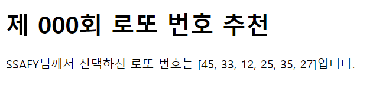

# WorkShop



1. intro/urls.py

```python
from django.urls import path
from . import views

urlpatterns = [
    path('', views.index, name='index'),

    path('lotto', views.lotto, name='lotto'),
    
]

```

2. pages/views.py

```python
from django.shortcuts import render
import random
# Create your views here.
def index(request):
    return render(request, 'main/index.html')

def lotto(request):
    val = list(random.sample(range(1,46), 6))
    context = {
        'val' : val
    }
    return render(request, 'main/lotto.html', context)
```

3. templates/lotto.html

```html
<!DOCTYPE html>
<html lang="en">
<head>
  <meta charset="UTF-8">
  <meta http-equiv="X-UA-Compatible" content="IE=edge">
  <meta name="viewport" content="width=device-width, initial-scale=1.0">
  <title>Document</title>
</head>
<body>
  <h1>제 000회 로또 번호 추천</h1>
  <p>SSAFY님께서 선택하신 로또 번호는 {{ val }}입니다.</p>
</body>
</html>
```

