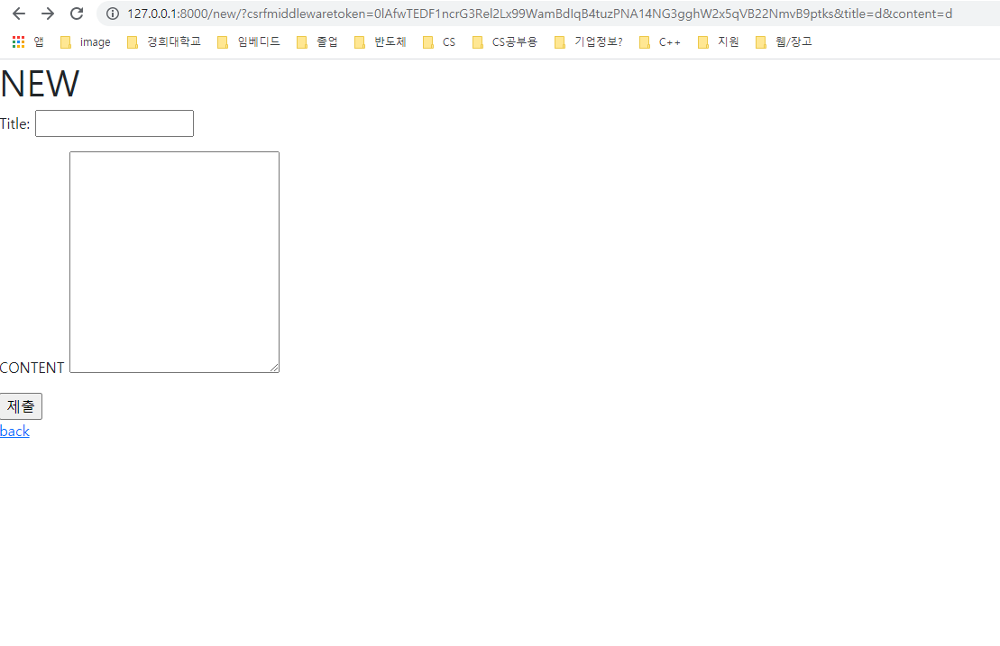

# WorkShop

urls.py

```python
from django.urls import path

from . import views

urlpatterns = [
    path('', views.index, name='index'),
    path('new/', views.new, name='new'),
    path('create/', views.create, name='create'),

]

```


views.py

```python
from django.shortcuts import render
from . models import Article
# Create your views here.

def index(request):
    articles = Article.objects.all()
    context = {
        'articles' : articles,
    }
    return render(request, 'articles/index.html', context)

def new(request):
    return render(request, 'articles/new.html')

def create(request):
    title = request.GET.get('title')
    content = request.GET.get('content')
    article = Article(title=title, content=content)
    article.save()
    return render(request, 'articles/create.html')
```


new, create, index.html

```html



<h1>INDEX</h1>
<a href="new">NEW</a>
<p></p>
<h1>제목: 게시글 제목</h1>
<h4>내용: 게시글 내용</h4>
<a href="">DETAIL</a>






  <h1>NEW</h1>
  <form action="">
      
      <label for="title">Title:</label>
      <input type="text" id="title" name="title">
      <p></p>
      <label for="content">CONTENT</label>
      <textarea name="content" id="content" cols="30" rows="10"></textarea>
      <p></p>
      <input type="submit">
  </form>
  <a href=''>back</a>






  <h1>create</h1>

```



