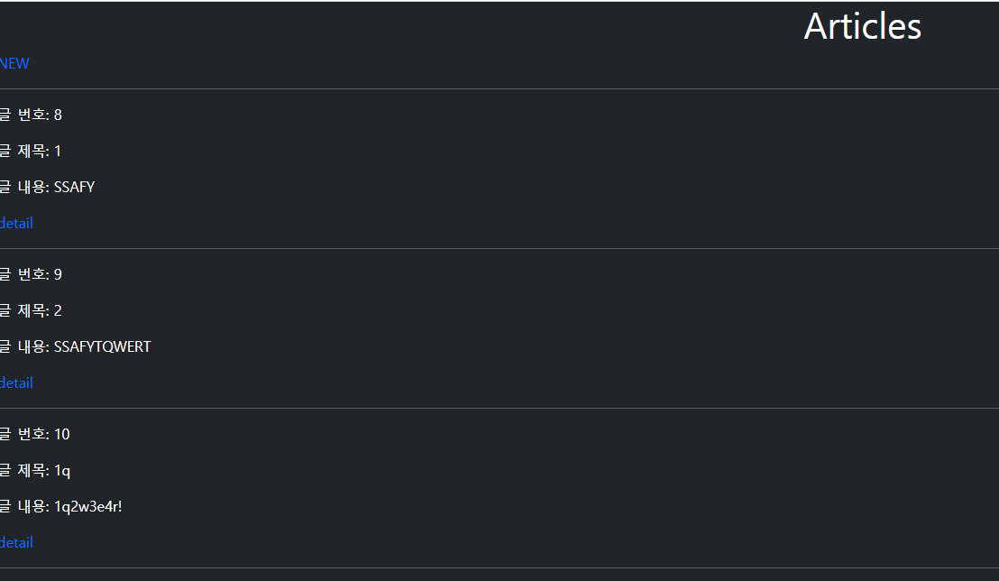
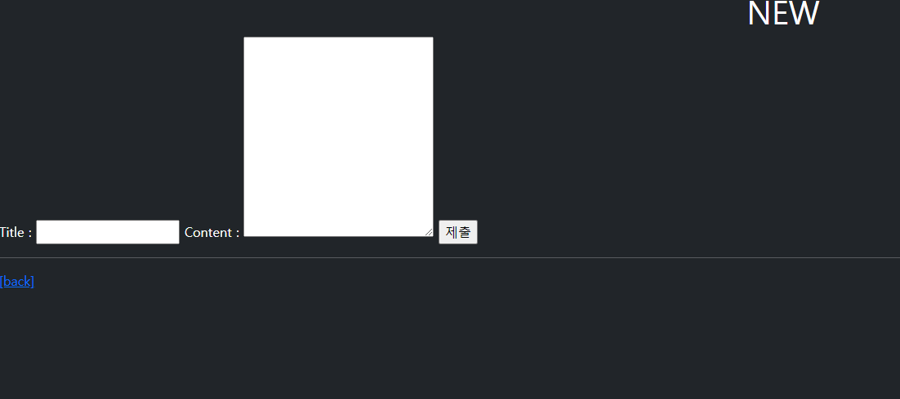
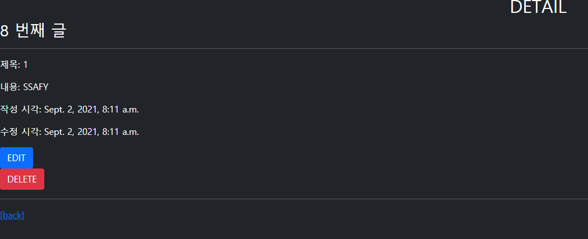
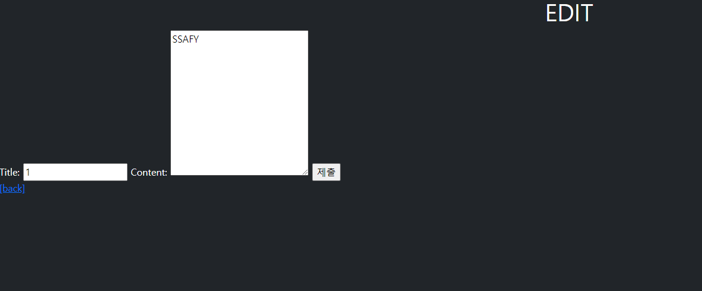

# WorkShop



```html



  <h1 class="text-center">Articles</h1>
  <a href="" class="text-decoration-none">NEW</a>
  <hr>
  
    <p>글 번호: {{ article.pk }}</p>
    <p>글 제목: {{ article.title }}</p>
    <p>글 내용: {{ article.content }}</p>
    <a href="" class="text-decoration-none">detail</a>
    <hr>
  

```




```html



  <h1 class="text-center">NEW</h1>
  <form action="" method="POST">
    
    <label for="title">Title : </label>
    <input type="text" name="title">
    <label for="content">Content : </label>
    <textarea name="content" id="content" cols="30" rows="10"></textarea>
    <input type="submit">
  </form>
  <hr>
  <a href="">[back]</a>


```



```html



  <h2 class='text-center'>DETAIL</h2>
  <h3>{{ article.pk }} 번째 글</h3>
  <hr>
  <p>제목: {{ article.title }}</p>
  <p>내용: {{ article.content }}</p>
  <p>작성 시각: {{ article.created_at }}</p>
  <p>수정 시각: {{ article.updated_at }}</p>
  <a href="" class="btn btn-primary">EDIT</a>
  <form action="" method="POST">
    
    <button class="btn btn-danger">DELETE</button>
  </form>
  <hr>
  <a href="">[back]</a>

```





```html



  <h1 class="text-center">EDIT</h1>
  <form action="" method="POST">
    
    <label for="title">Title: </label>
    <input type="text" name="title" value="{{ article.title }}">
    <label for="content">Content: </label>
    <textarea name="content" id="content" cols="30" rows="10">{{article.content}}</textarea>
    <input type="submit">
  </form>
  <a href="">[back]</a>

```


views.py

```python
from django.shortcuts import redirect, render
from .models import Article
# Create your views here.

def index(request):
    articles = Article.objects.all()
    context = {
        'articles' : articles,
    }
    return render(request, 'articles/index.html', context)

def new(request):
    return render(request, 'articles/new.html')    

def create(request):
    title = request.POST.get('title')
    content = request.POST.get('content')

    article = Article(title=title, content=content)
    article.save()
    return redirect('articles:detail', article.pk)

def detail(request, pk):
    article = Article.objects.get(pk=pk)
    context = {
        'article' : article,
    }
    return render(request, 'articles/detail.html', context)

def delete(request, pk):
    article = Article.objects.get(pk=pk)
    if request.method == "POST":
        article.delete()
        return redirect('articles:index')
    else:
        return redirect('articles:detail', article.pk)

def edit(request, pk):
    article = Article.objects.get(pk=pk)
    context = {
        'article' : article,
    }
    return render(request, 'articles/edit.html', context)

def update(request, pk):
    article = Article.objects.get(pk=pk)
    article.title = request.POST.get('title')
    article.content = request.POST.get('content')
    article.save()
    return redirect('articles:detail', article.pk)
```

