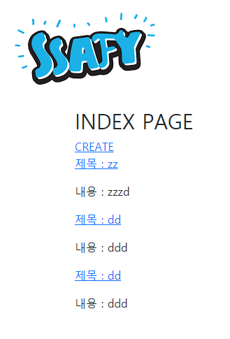

# WorkShop



views

```python
from django.shortcuts import render, redirect, get_object_or_404
from django.views.decorators.http import require_safe, require_POST
from .models import Article
from .forms import ArticleForm
# Create your views here.

def index(request):
    articles = Article.objects.all()
    context = {
        'articles' : articles
    }
    return render(request, 'articles/index.html', context)

def create(request):
    if request.method == 'POST':
        form = ArticleForm(request.POST, request.FILES)
        if form.is_valid():
            form.save()
            return redirect('articles:index')
    else:
        form = ArticleForm()
    context = {
        'form' : form
    }
    return render(request, 'articles/create.html', context)

def detail(request, pk):
    article = get_object_or_404(Article, pk=pk)
    context = {
        'article' : article
    }
    return render(request, 'articles/detail.html', context)


def delete(request, pk):
    article = get_object_or_404(Article, pk=pk)
    if request.method == 'POST':
        article.delete()
        return redirect('articles:index')
    return redirect('articles:detail', article.pk)

def update(request, pk):
    article = get_object_or_404(Article, pk=pk)
    if request.method == 'POST':
        form = ArticleForm(request.POST, request.FILES, instance=article)
        if form.is_valid():
            form.save()
            return redirect('articles:detail', article.pk)
    else:
        form = ArticleForm(instance=article)
    context = {
        'article': article,
        'form': form,
    }
    return render(request, 'articles/update.html', context)

```


create

```html



  <h1>CREATE</h1>
  <form action="" method="POST" enctype="multipart/form-data">
    
    {{ form.as_p }}
    <input type="submit" value="작성">
  </form>


```


detail

```html



  
    
  
  <p>제목 : {{article.title}}</p>
  <p>내용 : {{article.content}}</p>
  <p>생성 시간 : {{article.created_at}}</p>
  <p>수정 시간 : {{article.updated_at}}</p>
  <a href="">수정</a>
  <form action="" method="POST">
    
    <button>삭제</button>
  </form>
  <a href="">[back]</a>

```


index

```html


  <h2>INDEX PAGE</h2>
  <a href="">CREATE</a>
  
    <a href=""><p>제목 : {{article.title}}</p></a>
    <p>내용 : {{article.content}}</p>
  

```


update

```html



  <h1>UPDATE</h1>
  <form action="" method="POST" enctype="multipart/form-data">
    
    {{ form.as_p }}
    <button>수정</button>
  </form>
  <a href="">[back]</a>


```

